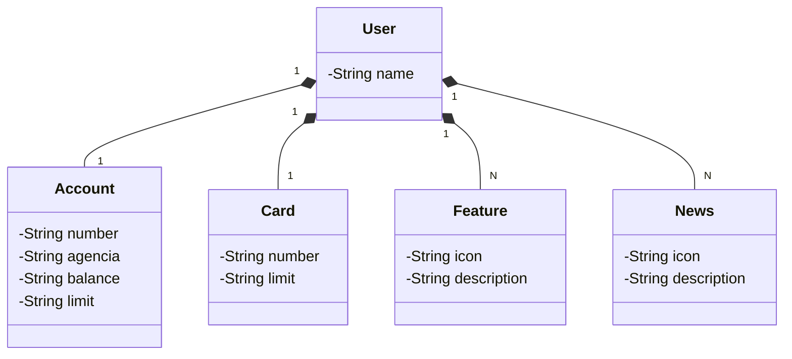

# Bootcamp Santander Java
Api Restful de um simples sistema bancário.
## Diagrama de Classe

```mermaid
classDiagram
    class User {
        -String name
    }
    
    class Account {
        -String number
        -String agencia
        -String balance
        -String limit
    }
    
    class Feature {
        -String icon
        -String description
    }
    
    class Card {
        -String number
        -String limit
    }
    
    class News {
        -String icon
        -String description
    }

    User "1" * -- "1" Account
    User "1" *-- "1" Card
    User "1" *-- "N" Feature
    User "1" *-- "N" News

```
